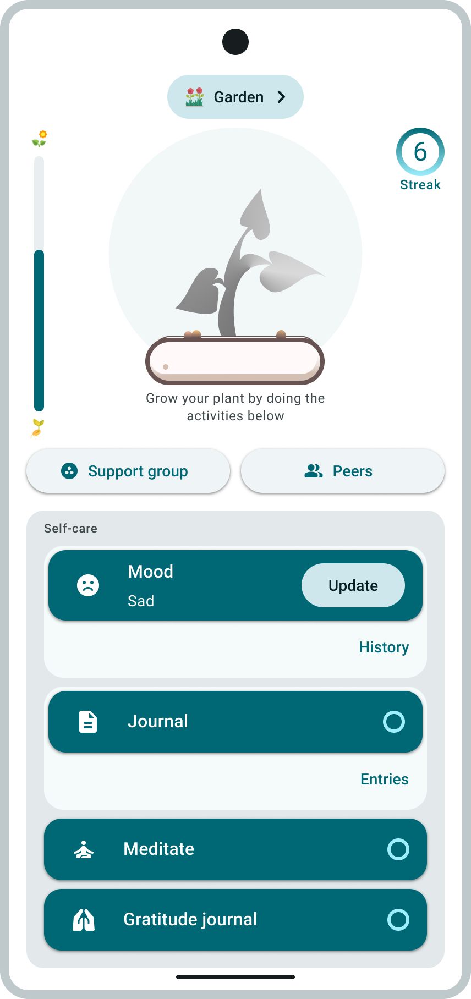
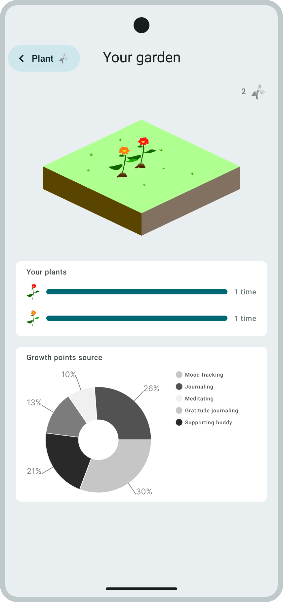

---
# the default layout is 'page'
icon: fas fa-info-circle
order: 4
---

In this second semester of my third year and until the first semester of the next academic year, we will be having a *Capstone Project and Research* course. The main objective of this course is to apply all IT knowledge into one final project and do a study on how that project benefits the involved parties. We are given the power to decide on what niche we are going to focus on, e.g. IoT or mobile, desktop, or web application, or game, etc. To get started, we are randomly grouped into three to four members. We are then tasked to identify five (5) possible project titles that our group sees as innovative **AND** achievable within the time frame and budget. From the five titles, we ranked them from what we really wanted to less wanted to implement. With that said, the group’s most wanted title will be presented to the panelists to seek approval.

## The present

Fast-forward to now, thankfully, our most wanted title, entitled **“Mind Garden – Gamified Mental Wellness Tracker with Anonymous Peer Support”**, was approved.

## What is this project all about?

> **DISCLAIMER**
> 
> This project is an academic work created for educational purposes. It includes images from [Forest: Focus for Productivity](https://play.google.com/store/apps/details?id=cc.forestapp&pcampaignid=web_share), available on the Google Play Store, used under the principle of fair use for educational commentary and analysis. This project is not affiliated with, endorsed by, or sponsored by [Seekrtech](https://seekrtech.com). All trademarks, service marks, trade names, trade dress, product names, and logos appearing in this project are the property of their respective owners.
> 
> This project is not intended for commercial use and is limited to academic evaulation within our university.
{: .prompt-warning }

### The Gamified Side

To elaborate on the idea of the gamified side, here's an app the idea was inspired on:

 [**Forest: Focus for Productivity**](https://play.google.com/store/apps/details?id=cc.forestapp&pcampaignid=web_share)

  

  
  _Figure 1.1: Grow a tree preview_

  

  
  _Figure 1.2: View forest preview_

But, instead of tracking focus and trees, we will be tracking mental wellness activities and garden plants. For every self-care activities, users will receive growth points for their plant. Accumulating these growth points can help the plant to fully grow, which will then be transferred onto their virtual garden.

  

  
  _Figure 2.1: Homescreen, Plant tab_

  

  
  _Figure 2.2: Homescreen, Garden tab_

### Anonymous Peer Support

Think of a chat app where your identity is hidden where you can express your thoughts and feelings freely to your peers.

...

Enjoy! ಥ_ಥ
